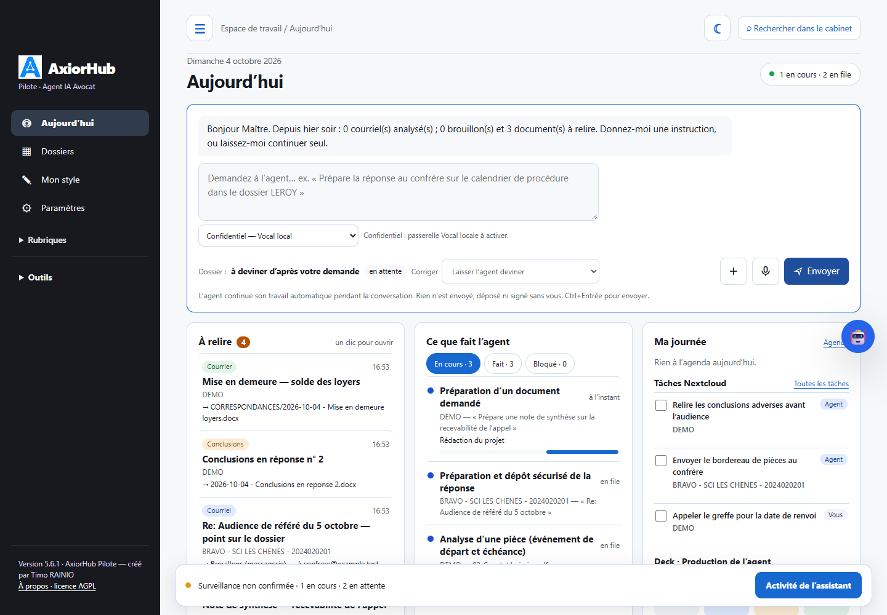
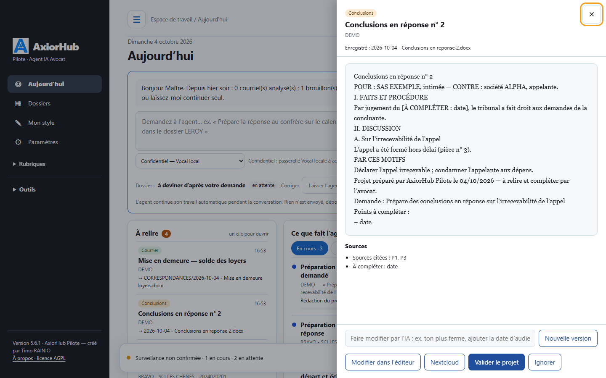
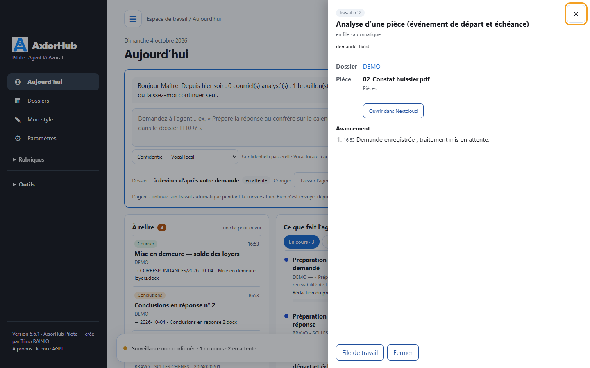
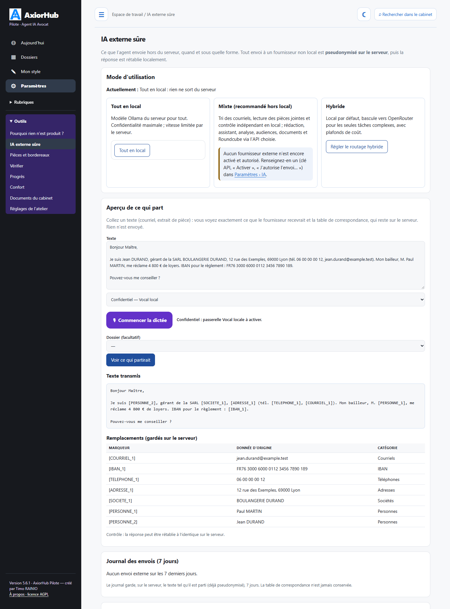
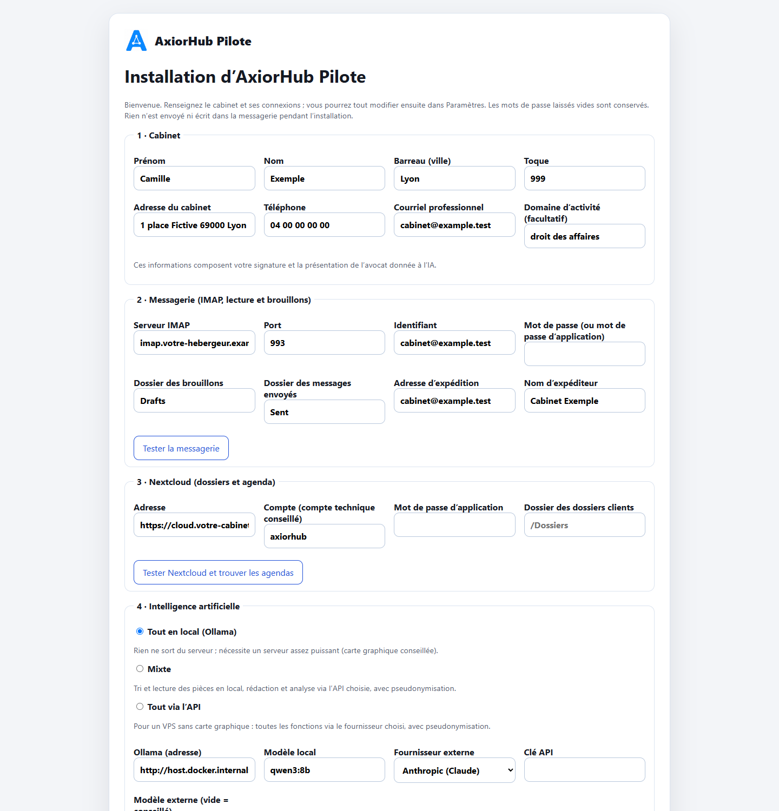
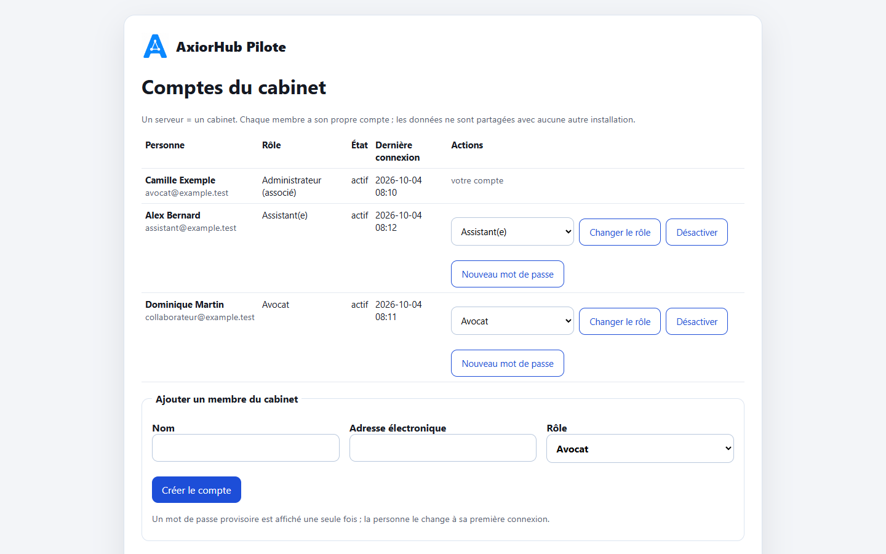
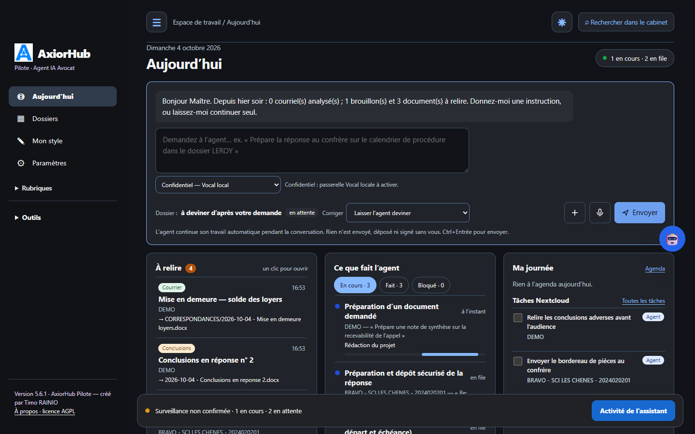

<p align="center"></p>

<h1 align="center">AxiorHub Pilote</h1>

<p align="center"><strong>L'agent IA d'exécution du cabinet d'avocats</strong><br>
Courriels, dossiers, pièces, échéances, agenda et projets d'actes, sur votre serveur, avec une IA locale ou une IA externe pseudonymisée.</p>

<p align="center">Créé par <strong>Timo RAINIO</strong>, avocat au Barreau de Lyon · Licence <a href="LICENSE">AGPL-3.0-or-later</a> · Version 5.6.1</p>

<p align="center"></p>

---

## En une phrase

AxiorHub Pilote lit la messagerie et les dossiers du cabinet, comprend ce qui arrive et **prépare le travail** :
brouillons de réponse, projets d'actes, bordereaux de pièces, échéances, tâches. Il n'envoie rien, ne signe rien et
ne dépose rien. Chaque production est un brouillon ou un projet que l'avocat relit, corrige et valide.

| | |
|---|---|
| **Pour qui** | Avocats exerçant seuls ou en petite structure, avec leurs collaborateurs et assistants. |
| **Où** | Sur le serveur du cabinet (un VPS suffit) : la messagerie et Nextcloud restent les vôtres. |
| **Avec quelle IA** | Locale (Ollama), externe (Anthropic, OpenAI, Mistral…) **pseudonymisée**, ou les deux. |
| **Ce qu'il ne fait jamais** | Envoyer un courriel, signer, déposer, fixer seul une date de procédure, inventer une source. |

## Ce que fait l'agent

### Le poste de pilotage

L'écran « Aujourd'hui » rassemble ce qui demande l'avocat :

- une **zone de saisie** : « Prépare la réponse au confrère sur le calendrier de procédure dans le dossier LEROY ».
  L'agent devine le dossier, que vous pouvez corriger. Vous pouvez joindre un document ou dicter (micro) ;
- **À relire** : brouillons de courriels et projets de documents prêts, un clic pour les ouvrir ;
- **Ce que fait l'agent** : ce qui est en cours, terminé ou bloqué, avec le nom de la pièce ou de la demande traitée ;
- **Ma journée** : audiences et rendez-vous du jour, tâches Nextcloud (celles de l'agent et les vôtres), tableau Deck ;
- **Routines** : briefing du matin, tri matinal des courriels, bilan de la semaine ;
- **Style du cabinet** : habitudes d'écriture proposées, à valider.

Un bandeau en bas de page montre l'activité de l'agent en direct. Un mode sombre est disponible.

### Relire et valider en un clic

<p align="center"></p>

Chaque projet s'ouvre dans un volet : texte complet, sources citées, points « À COMPLÉTER ». Vous pouvez :
- **valider** le projet ;
- l'**ignorer** ;
- l'**ouvrir dans l'éditeur** (Word en ligne avec OnlyOffice) ou dans Nextcloud ;
- demander une **nouvelle version** en une phrase (« ton plus ferme », « ajouter la date d'audience »).

L'agent apprend de ces décisions.

### Savoir exactement ce que fait l'agent

<p align="center"></p>

Chaque travail s'ouvre sur son détail :
- le dossier ;
- la pièce analysée, le document demandé ou le courriel concerné ;
- les étapes franchies et le résultat ;
- les liens pour ouvrir le fichier produit ;
- le bouton « Relancer » en cas de blocage.

L'écran « Pourquoi rien n'est produit ? » explique toute panne : services, file de travail, erreurs et leur motif,
connexions, recette automatique.

### Courriels

- **Tri** des messages entrants : courriel de client, de confrère, de juridiction, notification RPVA, publicité,
  liste de diffusion, message automatique.
- **Rattachement au bon dossier** d'après les correspondants, les références et l'historique ; en cas de doute, une
  proposition est faite et l'association confirmée sert ensuite pour les messages suivants.
- **Brouillons de réponse** déposés dans le dossier Brouillons de votre messagerie (IMAP), dans le fil d'origine,
  avec votre signature. Rien n'est envoyé.
- **Atelier « Courriels à relire »** :
  - modifier le texte, le destinataire et l'objet ;
  - dicter des corrections à la voix ;
  - demander une reformulation (« plus court », « plus courtois », « ajouter un rappel de la date ») ;
  - vérifier les citations juridiques ;
  - enregistrer une règle « toujours faire comme ça ».
- **Envoi**, désactivé par défaut. S'il est activé, il passe par une confirmation qui récapitule les destinataires, l'objet et
  les pièces jointes.
- **Pourquoi pas de brouillon ?** Chaque courriel non traité indique son motif (message du cabinet, liste de diffusion,
  dossier incertain, décision de l'avocat nécessaire…) et l'action pour corriger.

### Documents et projets d'actes

- **Demande en langage naturel** : conclusions, assignation, requête, courrier, mise en demeure, note, consultation,
  contrat. Le projet est rédigé à partir du dossier (pièces, faits, chronologie) et des **modèles du cabinet**.
- **Rangement automatique** dans l'arborescence du dossier (PROCEDURE, CORRESPONDANCES, PROJETS, LIVRABLES).
- **Nouvelles versions** sur instruction, sans écraser l'original, y compris pour un document que vous avez rédigé.
- **Édition en ligne** du document Word dans le navigateur (OnlyOffice), sans téléchargement.

### Pièces et bordereaux

- Lecture des PDF du dossier, proposition d'**ordre**, d'**intitulés** et de **dates**.
- **Numérotation** et **tampon** « Pièce n° X » sur les pages, **bordereau** Word et PDF à partir de votre modèle.
- **PDF unique** avec un signet par pièce.
- **Renvois renumérotés** dans les conclusions, avec suivi des modifications.
- **Découpage pour le dépôt e-Barreau** selon la taille maximale des envois.
- Tout se fait en local, sans IA, et seulement après votre code de confirmation. Les fichiers d'origine ne sont jamais
  modifiés.

### Échéances, agenda et tâches

- **Avis de procédure** (renvoi, convocation, calendrier) : les dates sont extraites et vérifiées dans le texte,
  inscrites à l'agenda Nextcloud, et un courriel d'information est préparé.
- **Échéances de procédure** : l'événement de départ (signification, notification, déclaration d'appel…) est repéré
  dans la pièce. Le délai est calculé par des règles déterministes, jamais par l'IA. Chaque date est proposée « à
  confirmer » avec son calcul, puis des rappels sont émis en cascade.
- **Prescription et forclusion** : règles versionnées avec leurs articles, calcul détaillé pas à pas.
- **Agenda et tâches** Nextcloud (CalDAV) et **Deck** : programme de travail par dossier, tâches de l'agent et
  tâches personnelles, cartes qui suivent l'avancement de la production.

### Dossiers

- **Fiche de dossier** : juridiction, n° RG, parties, prochaine échéance, dernier acte reçu, points en attente.
- **Chronologie** unifiée (courriels, pièces, actes, audiences).
- **Faits du dossier** extraits des pièces (RG, montants, dates, parties), chacun avec sa source, à valider.
- **Recherche** dans tout le cabinet (courriels, documents, dossiers).
- **Préparation des rendez-vous** : fiche sourcée avant le rendez-vous, projet de compte rendu après.

### Métier

- **Temps et honoraires** : temps proposés à partir de l'activité réelle, comptés seulement une fois validés ;
  budgets et alertes.
- **Conflits d'intérêts** : recherche des parties dans les dossiers existants, rapport sourcé ; aucune production pour
  un dossier nouveau tant que l'avocat n'a pas décidé.
- **Recherche juridique tracée** : une décision n'est citée qu'après vérification sur la source officielle.
- **Préparation d'audience** et analyse des écritures adverses (projets supervisés).

### Style du cabinet

L'agent lit vos écrits définitifs (procédure, correspondances, projets) et vos courriels envoyés, puis propose vos
habitudes : formule d'ouverture et de clôture, plan habituel des conclusions, formules récurrentes. Une fois validées,
elles s'appliquent aux brouillons et aux documents. Aucune phrase contenant un nom, un numéro ou une adresse n'est
retenue.

### Une IA externe, mais pseudonymisée

<p align="center"></p>

Avant tout envoi à une IA non locale, les noms, sociétés, adresses, téléphones, courriels, IBAN et numéros sont
remplacés par des marqueurs (`[PERSONNE_1]`, `[SOCIETE_1]`…). La table de correspondance reste sur le serveur, et la
réponse est rétablie localement. L'**aperçu** montre exactement ce qui partirait. Trois modes sont proposés :
- **tout en local** ;
- **mixte** : tri et lecture en local, rédaction via l'API ;
- **tout via l'API**, pour un VPS sans carte graphique.

### Installation guidée et comptes du cabinet

<p align="center">
&nbsp;</p>

- **Assistant d'installation** au premier démarrage : cabinet, messagerie, Nextcloud, IA et mode de fonctionnement.
  Chaque connexion se teste.
- **Comptes et rôles** : administrateur, avocat, assistant(e). Les droits sont contrôlés par le serveur, et chaque
  opération est journalisée (voir [docs/COMPTES-ET-ROLES.md](docs/COMPTES-ET-ROLES.md)).

### Et aussi

- **Application mobile** (installable depuis le navigateur) avec notifications : courriels à valider, échéances,
  recherche.
- **Dictée vocale locale** (passerelle facultative) pour les instructions et les corrections.
- **Intégrations** Roundcube (bouton dans le webmail) et Open WebUI (outil pour la conversation).
- **Mises à jour vérifiées** (manifeste SHA-256, signature, retour arrière) et **recette automatique** après chaque
  installation.

<p align="center"></p>

## Confidentialité d'abord

- **Une installation = un cabinet.** Les données restent sur votre serveur (messagerie, Nextcloud, base locale).
- **IA locale par défaut.** Une IA externe ne s'active qu'avec votre accord explicite, et tout texte qui sort est
  pseudonymisé.
- **Aucune donnée n'est transmise à l'auteur du logiciel.** Pas de télémétrie.
- Les captures de ce document n'utilisent que des **données fictives**.

Détails : [docs/CONFIDENTIALITE.md](docs/CONFIDENTIALITE.md).

## Installer

| Situation | Guide |
|---|---|
| **Nouveau VPS** (OVH ou autre) : AxiorHub Pilote + Nextcloud + Roundcube + OnlyOffice, Apache, HTTPS Let's Encrypt | les étapes ci-dessous, détails dans [docs/INSTALLATION-VPS.md](docs/INSTALLATION-VPS.md) |
| Serveur existant, AxiorHub Pilote seul en Docker | [DOCKER-INSTALLATION.md](DOCKER-INSTALLATION.md) |
| Serveur existant, installation système (systemd), mise à jour d'une version antérieure | [docs/INSTALLATION-SERVEUR.md](docs/INSTALLATION-SERVEUR.md) |

### Installation complète sur un VPS, pas à pas

Comptez une heure environ, dont le délai de propagation des noms de domaine. Les exemples utilisent le domaine
`votre-cabinet.fr` : remplacez-le partout par le vôtre.

#### Étape 1 — Louer le serveur (VPS)

1. Chez OVHcloud (ou un autre hébergeur) : *Bare Metal Cloud → Serveurs privés virtuels → Commander*.
2. Choisissez :
   - **système** : Debian 12 ou Ubuntu 24.04 ;
   - **mémoire** : 8 Go au minimum sans IA locale ; 32 Go et idéalement une carte graphique pour l'IA locale (sinon,
     choisissez plus tard l'IA externe pseudonymisée) ;
   - **disque** : 80 Go au minimum, selon le volume de vos dossiers ;
   - **localisation** : un centre de données en France ou dans l'Union européenne.
3. Ajoutez votre **clé SSH** à la commande (recommandé) ou notez le mot de passe reçu par courriel.
4. Relevez l'**adresse IPv4** du serveur (et l'IPv6 si elle est fournie) dans l'espace client.

#### Étape 2 — Réserver le nom de domaine

1. *Web Cloud → Noms de domaine → Commander un nom de domaine* (par exemple `votre-cabinet.fr`). Si le cabinet a déjà
   un domaine, gardez-le : seuls quatre sous-domaines seront ajoutés, le site et la messagerie existants ne changent pas.
2. Attendez la confirmation d'activation (quelques minutes à quelques heures pour un `.fr`).

#### Étape 3 — Créer les quatre adresses (zone DNS)

*Web Cloud → Noms de domaine → votre-cabinet.fr → Zone DNS → Ajouter une entrée*. Créez une entrée **A** pour chaque
sous-domaine, pointant vers l'IPv4 du VPS (et une entrée **AAAA** vers l'IPv6 si vous en avez une) :

| Sous-domaine | Type | Cible | Service |
|---|---|---|---|
| `agent` | A | IPv4 du VPS | AxiorHub Pilote |
| `cloud` | A | IPv4 du VPS | Nextcloud (dossiers, agenda, tâches) |
| `webmail` | A | IPv4 du VPS | Roundcube (webmail) |
| `office` | A | IPv4 du VPS | OnlyOffice (édition des documents) |

Ne touchez pas aux entrées **MX** ni à celles de votre messagerie actuelle. Vérifiez la propagation depuis votre
ordinateur (elle prend de quelques minutes à quelques heures) :

```bash
nslookup agent.votre-cabinet.fr
```

La réponse doit afficher l'adresse IP du VPS, pour chacun des quatre noms.

#### Étape 4 — Première connexion au serveur

```bash
ssh debian@IP_DU_VPS           # « ubuntu@ » sur Ubuntu ; « root@ » selon l'hébergeur
sudo apt update && sudo apt full-upgrade -y
sudo apt install -y git unattended-upgrades
sudo dpkg-reconfigure -plow unattended-upgrades   # mises à jour de sécurité automatiques : répondre « Oui »
```

Si vous utilisez le pare-feu réseau de l'hébergeur (« Network Firewall » chez OVH), ouvrez les ports **22** (SSH),
**80** et **443** (web).

#### Étape 5 — Télécharger AxiorHub Pilote

```bash
sudo git clone https://github.com/Arthur-Llevelys/AxiorHub-Pilote.git /opt/axiorhub-src
cd /opt/axiorhub-src
```

#### Étape 6 — Lancer l'installation

```bash
sudo bash deploy/vps/install-vps.sh
```

Le script pose ces questions :

| Question | Exemple de réponse |
|---|---|
| Nom de domaine du cabinet | `votre-cabinet.fr` |
| Adresses d'AxiorHub Pilote, de Nextcloud, du webmail, du serveur de documents | Entrée pour accepter `agent.`, `cloud.`, `webmail.`, `office.` |
| Courriel pour Let's Encrypt | l'adresse qui recevra les avis d'expiration des certificats |
| Serveur IMAP / SMTP de la messagerie du cabinet | indiqués par votre hébergeur de messagerie (par exemple `ssl0.ovh.net` pour les deux chez OVH) |
| Activer l'IA locale Ollama ? | `o` seulement si le serveur a beaucoup de mémoire ou une carte graphique |
| Acceptez-vous les conditions de Let's Encrypt ? | `o` pour obtenir les certificats HTTPS |

Il installe ensuite Docker, Apache et Certbot, crée le fichier de réglages `deploy/vps/.env` en **générant tous les
mots de passe**, vérifie les noms de domaine, démarre les conteneurs, installe les hôtes virtuels Apache, obtient les
certificats HTTPS (avec redirection automatique de HTTP vers HTTPS et renouvellement automatique), puis règle Nextcloud
(Agenda, Tâches, Deck, Contacts, OnlyOffice). Le script peut être relancé sans risque.

#### Étape 7 — Vérifier ou modifier le fichier `.env`

Le fichier `deploy/vps/.env` contient les réglages et les mots de passe. Il n'est lisible que par l'administrateur et
ne doit **jamais** être publié ni envoyé par courriel.

```bash
sudo nano /opt/axiorhub-src/deploy/vps/.env
```

| Variable | Rôle | À modifier ? |
|---|---|---|
| `DOMAIN_AGENT`, `DOMAIN_CLOUD`, `DOMAIN_MAIL`, `DOMAIN_OFFICE` | les quatre adresses de l'étape 3 | remplies par le script |
| `LETSENCRYPT_EMAIL` | avis d'expiration des certificats | rempli par le script |
| `IMAP_HOST`, `IMAP_PORT`, `SMTP_HOST`, `SMTP_PORT` | messagerie du cabinet, utilisée par le webmail | vérifier les ports (993 et 587 en général) |
| `NEXTCLOUD_ADMIN_USER`, `NEXTCLOUD_ADMIN_PASSWORD` | compte administrateur de Nextcloud | mot de passe généré : **notez-le** |
| `MYSQL_PASSWORD`, `MYSQL_ROOT_PASSWORD`, `ONLYOFFICE_JWT_SECRET`, `AXIORHUB_INTERNAL_API_TOKEN` | secrets techniques | générés ; ne pas modifier après l'installation |
| `AXIORHUB_PUBLIC_URL` | adresse publique d'AxiorHub Pilote | remplie par le script |
| `AXIORHUB_ALLOW_SIGNUP` | inscriptions publiques | laisser `false` |
| `AXIORHUB_OLLAMA_MODEL` | modèle d'IA locale | par exemple `qwen3:8b` ; plus gros si le serveur le permet |
| `AXIORHUB_SMTP_*` | envoi des liens « mot de passe oublié » | facultatif : mêmes valeurs que votre messagerie |
| `AXIORHUB_SOURCE_URL` | adresse du code source affichée dans « À propos » | à remplir si vous modifiez le logiciel (licence AGPL) |
| `COMPOSE_PROFILES` | `ollama` pour démarrer l'IA locale | vide sinon |

Pour générer vous-même un secret (si vous remplissez le fichier à la main à partir de `env.example`) :

```bash
openssl rand -base64 36 | tr -d '/+=' | cut -c1-40
```

Après toute modification, appliquez-la :

```bash
cd /opt/axiorhub-src/deploy/vps
sudo docker compose --env-file .env up -d
```

#### Étape 8 — Préparer Nextcloud

1. Ouvrez `https://cloud.votre-cabinet.fr` et connectez-vous avec `admin` et le mot de passe `NEXTCLOUD_ADMIN_PASSWORD`.
2. *Utilisateurs* : créez un compte pour chaque membre du cabinet, puis un compte technique **`axiorhub`**.
3. Créez le dossier des dossiers clients (par exemple `/Dossiers`, un sous-dossier par client ou affaire) et partagez-le
   avec le compte `axiorhub`, ainsi que les agendas du cabinet.
4. Connecté en tant qu'`axiorhub` : *Paramètres personnels → Sécurité → Créer un mot de passe d'application*. Notez-le
   pour l'étape 10.

#### Étape 9 — Préparer l'accès à la messagerie

AxiorHub Pilote lit la boîte du cabinet et y dépose des **brouillons** (rien n'est envoyé). Munissez-vous :
- du serveur IMAP et de son port (993 en général) ;
- de l'identifiant et du mot de passe de la boîte, ou d'un **mot de passe d'application** si votre messagerie en propose ;
- des noms exacts des dossiers « Brouillons » et « Envoyés » (souvent `Drafts` et `Sent`, ou `INBOX.Drafts`).

#### Étape 10 — Créer le compte administrateur et suivre l'assistant

1. Ouvrez `https://agent.votre-cabinet.fr/signup` : **le premier compte créé est administrateur**. Les inscriptions
   publiques se ferment ensuite.
2. L'**assistant d'installation** s'ouvre :
   - **Cabinet** : nom, barreau, adresse, téléphone, courriel, domaine d'activité. Ces informations servent à la
     signature et à la présentation donnée à l'IA ;
   - **Messagerie** : les informations de l'étape 9, puis *Tester la messagerie* ;
   - **Nextcloud** : `https://cloud.votre-cabinet.fr`, compte `axiorhub`, mot de passe d'application, dossier des
     dossiers ; *Tester Nextcloud* découvre aussi les agendas ;
   - **IA** :
     - *locale* : rien ne sort du serveur (profil `ollama`, voir ci-dessous) ;
     - *mixte* ou *externe* : choisissez le fournisseur, collez la clé d'API et cochez l'autorisation. Les textes
       envoyés sont toujours pseudonymisés ;
   - **Mode** : commencez en **observation** (AxiorHub Pilote analyse sans rien écrire).
3. *Enregistrer et terminer l'installation* : le **poste de pilotage** s'affiche.
4. *Comptes* (en bas du menu) : créez les comptes des membres du cabinet (administrateur, avocat ou assistant). Un mot de
   passe provisoire s'affiche une seule fois ; il sera changé à la première connexion.

IA locale : après avoir mis `COMPOSE_PROFILES=ollama` dans `.env` et relancé `docker compose`, téléchargez le modèle :

```bash
cd /opt/axiorhub-src/deploy/vps
sudo docker compose --env-file .env exec ollama ollama pull qwen3:8b
```

#### Étape 11 — Mettre en route

1. Pendant quelques jours, laissez AxiorHub Pilote en **observation**. Contrôlez les rattachements des courriels aux dossiers
   (*Associations*) et les analyses.
2. Passez en mode **brouillons** (*Paramètres*). Les projets de réponse apparaissent dans votre dossier Brouillons et
   dans « À relire ».
3. Activez les automatismes un par un (*Paramètres → Automatismes*).

#### Étape 12 — Vérifier, sauvegarder, mettre à jour

```bash
cd /opt/axiorhub-src/deploy/vps
sudo docker compose --env-file .env ps        # tous les services « running » ou « healthy »
sudo certbot renew --dry-run                  # renouvellement automatique des certificats
```

Sauvegarde chaque nuit (base et fichiers Nextcloud, données d'AxiorHub Pilote et du webmail, `.env`, conservation 14 jours) :

```bash
echo '30 2 * * * root bash /opt/axiorhub-src/deploy/vps/backup.sh /var/backups/axiorhub' | sudo tee /etc/cron.d/axiorhub-backup
```

Les sauvegardes contiennent des données de clients : **chiffrez-les et copiez-les hors du serveur**, et testez une
restauration.

Mise à jour vers une nouvelle version :

```bash
cd /opt/axiorhub-src && sudo git pull
cd deploy/vps && sudo docker compose --env-file .env up -d --build
```

Problèmes fréquents (certificat refusé, domaine non approuvé par Nextcloud, document OnlyOffice inaccessible…) :
voir [docs/INSTALLATION-VPS.md](docs/INSTALLATION-VPS.md#8-problèmes-fréquents).

## Architecture

```
            Internet (HTTPS, Let's Encrypt)
                         │
                  Apache (hôtes virtuels)
     ┌──────────────┬───────────┴───┬────────────────┐
 agent.…         cloud.…        webmail.…        office.…
 AxiorHub Pilote Nextcloud      Roundcube        OnlyOffice
 (8626)          (8080)         (8081)           (8082)
   │  workers, surveillance IMAP        │
   ├── IMAP/SMTP du cabinet ────────────┘
   ├── WebDAV / CalDAV Nextcloud
   └── IA : Ollama local (option) │ API externe pseudonymisée (option)
```

Voir [docs/ARCHITECTURE.md](docs/ARCHITECTURE.md).

## Développer

```bash
python3 -m unittest discover -s tests -p 'test_*.py' -q
python3 scripts/privacy-scan.py
python3 scripts/build-release.py dist/axiorhub-mail-agent-5.6.1.tar.gz
```

Python 3.11 ou plus récent, bibliothèque standard pour le cœur, Waitress pour le serveur web ; Poppler, Tesseract et
LibreOffice pour les PDF, l'OCR et les documents. Contribuer :
[CONTRIBUTING.md](CONTRIBUTING.md) · Sécurité : [SECURITY.md](SECURITY.md) · Historique : [CHANGELOG.md](CHANGELOG.md).

## Licence et mention d'auteur

Le code est distribué sous **GNU Affero General Public License v3.0 ou ultérieure**. Vous pouvez l'utiliser, l'étudier,
le modifier et le redistribuer ; si vous proposez une version modifiée à des utilisateurs à travers un réseau, vous
devez leur donner accès à son code source.

Condition additionnelle (article 7 b de l'AGPL) : toute version modifiée ou redistribuée conserve la mention
**« AxiorHub Pilote — créé par Timo RAINIO »** dans le fichier `NOTICE`, la page « À propos » et le pied du menu.

Le nom AxiorHub Pilote et le logo ne sont pas couverts par l'AGPL : voir [TRADEMARKS.md](TRADEMARKS.md) et
[LOGO-LICENSE.md](LOGO-LICENSE.md). Une version modifiée doit porter son propre nom.

> AxiorHub Pilote est un outil de préparation. Il ne remplace ni le jugement ni la responsabilité de l'avocat : toute
> production doit être relue avant envoi, signature, dépôt ou communication à un tiers.
