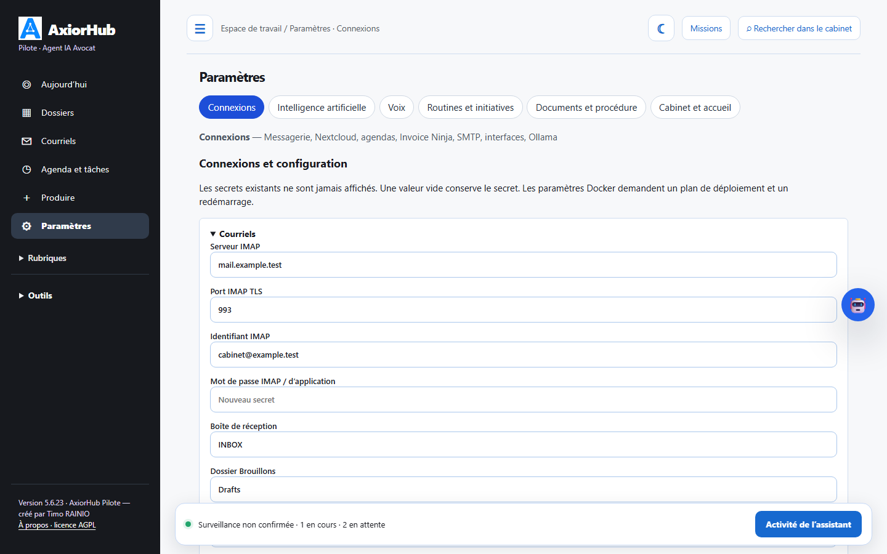
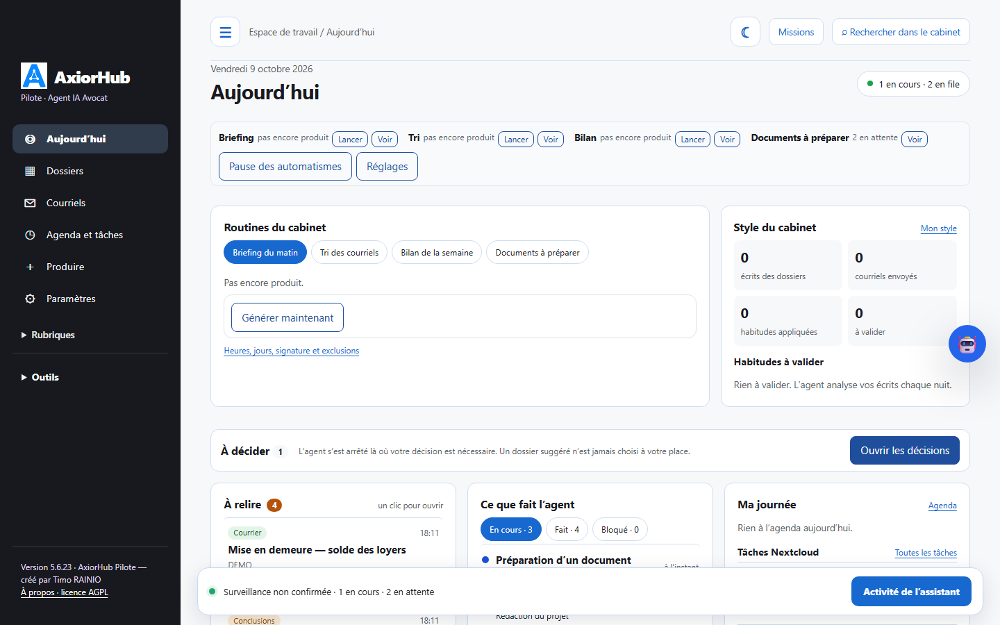
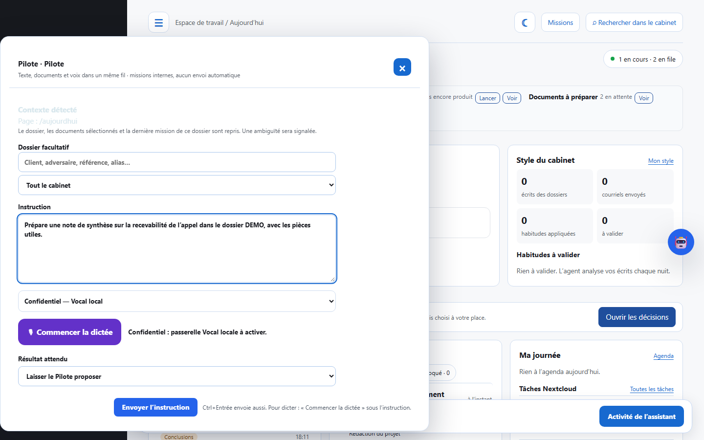
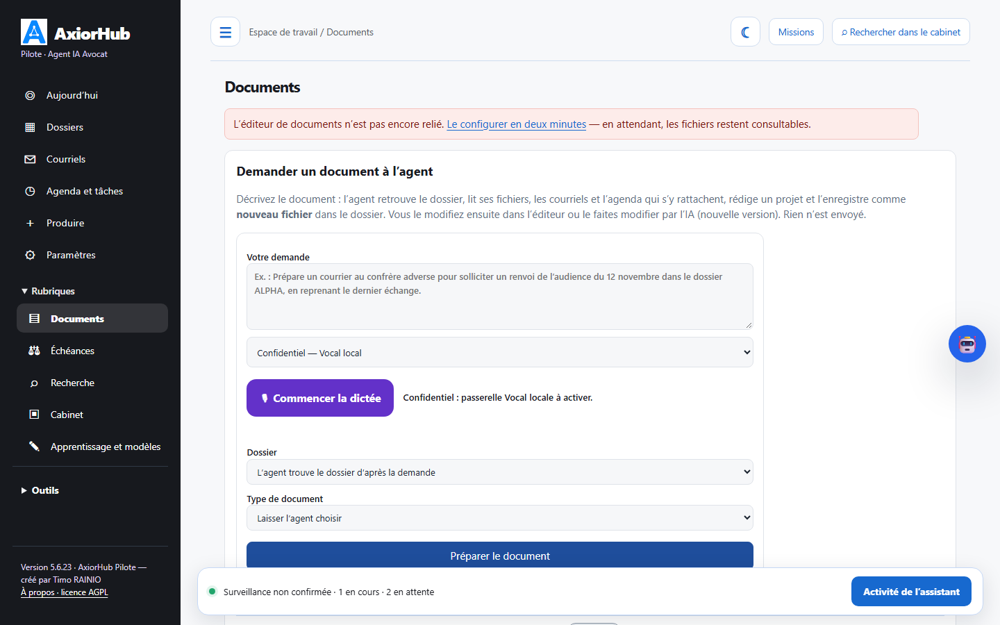
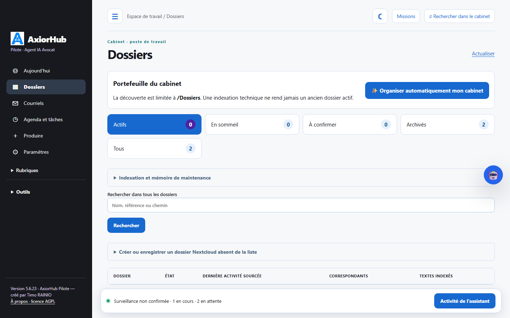

# AxiorHub Pilote sur un poste Ubuntu 24.04 : démarrer en dix minutes

Ce guide installe l’application de bureau sur un ordinateur sous Ubuntu 24.04 (64 bits) et vous mène jusqu’au premier briefing.
Rien ne quitte votre poste : l’intelligence artificielle, la voix et les données restent chez vous.

## Ce qu’il vous faut

| Élément | Pourquoi | Si vous ne l’avez pas |
|---|---|---|
| Ubuntu 24.04 et un compte avec `sudo` | installation du paquet | toute autre version récente d’Ubuntu ou de Debian convient en général |
| Une boîte de courriel IMAP (identifiant, mot de passe d’application) | lecture des courriels, brouillons dans votre dossier Brouillons | l’agent travaille alors seulement sur les dossiers |
| Vos dossiers : dossier synchronisé par le client Nextcloud, partage monté, ou Nextcloud par WebDAV | pièces, actes, projets déposés | un simple dossier local suffit pour essayer |
| Ollama avec un modèle de 8 milliards de paramètres (`qwen3:8b`) | rédaction, analyse, contrôle | sur ce poste (GPU conseillé) ou sur une machine du cabinet |
| Facultatif : Kokoro (voix de qualité) ; sinon eSpeak NG, installé avec le paquet | lecture du briefing et des réponses | la lecture reste disponible avec eSpeak |

Comptez dix minutes pour l’installation et le premier lancement, plus le temps de téléchargement du modèle Ollama (environ 5 Go).

## 1. Installer Ollama et un modèle (3 minutes, hors téléchargement)

```bash
curl -fsSL https://ollama.com/install.sh | sh
ollama pull qwen3:8b
```

Si Ollama tourne déjà sur une autre machine du cabinet (par exemple `192.168.1.115`), vous indiquerez son adresse à l’étape 4 ;
sur cette machine, lancez Ollama avec `OLLAMA_HOST=0.0.0.0`.

## 2. Installer AxiorHub Pilote (2 minutes)

Téléchargez `axiorhub-pilote-poste_<version>_amd64.deb` et son `.sha256`, puis :

```bash
sha256sum -c axiorhub-pilote-poste_*_amd64.deb.sha256
sudo apt install ./axiorhub-pilote-poste_*_amd64.deb
```

`apt` installe en même temps Python, la fenêtre d’application (WebKitGTK), LibreOffice Writer, Tesseract, Poppler et eSpeak NG.

## 3. Premier lancement (1 minute)

Ouvrez le menu des applications et lancez **AxiorHub Pilote**, ou tapez `axiorhub-pilote` dans un terminal.

Au premier lancement, l’application :

1. crée une configuration sans aucun secret et un compte local dans `~/.local/share/axiorhub-pilote` ;
2. démarre les services en arrière-plan (interface sur `127.0.0.1:8769`, worker, veille des courriels, passages de l’agent) ;
3. ouvre sa fenêtre, déjà connectée, sur l’assistant d’installation.

Si la fenêtre n’apparaît pas, le terminal indique l’adresse à ouvrir dans un navigateur et où lire le mot de passe local
(`axiorhub-pilote --print-password`).

## 4. Renseigner l’assistant d’installation (3 minutes)

L’assistant demande, dans l’ordre : la messagerie IMAP, l’emplacement des dossiers (dossier local ou Nextcloud), l’adresse
d’Ollama et le modèle. Chaque rubrique a un bouton de test ; rien n’est enregistré tant que le test n’est pas passé.

Ces réglages restent modifiables ensuite dans **Paramètres**, page unique à six rubriques :



## 5. Le premier briefing (1 minute)

Sur **Aujourd’hui**, la barre des routines propose **Briefing › Lancer**. Le briefing du matin s’affiche dans « Routines du cabinet »
et peut être lu à voix haute depuis le Pilote (« Écouter le briefing »).



## 6. Confier une première mission

Le bouton robot, à droite, ouvre le **Pilote**. Écrivez ou dictez une instruction, choisissez éventuellement un dossier et un
résultat attendu, puis **Envoyer l’instruction**. Le Pilote annonce ce qu’il va produire, travaille, et dépose le résultat :
réponse dans le fil, projet Word dans le dossier, brouillon dans votre messagerie. Rien n’est envoyé ni signé.



La page **Documents** permet aussi de demander un document précis (courrier, note, conclusions) ; les projets déposés et les documents à relire y apparaissent, ainsi que dans **À relire** :



**Dossiers** découvre les dossiers sous la racine configurée (actifs, en sommeil, à confirmer, archivés) ; chaque dossier a sa fiche : pièces, échéances, courriels, actes et missions :



## Au quotidien

- Fermer la fenêtre arrête les services. Pour qu’AxiorHub travaille en permanence (veille des courriels, briefing du matin) :

```bash
systemctl --user enable --now axiorhub-pilote
```

  La fenêtre se contente alors de se connecter aux services déjà actifs.
- `axiorhub-pilote --status` : état des services et emplacement des dossiers ; `axiorhub-pilote --stop` : arrêt.
- Journaux : `~/.local/state/axiorhub-pilote/` (`interface.log`, `worker.log`, `veille.log`, `passage.log`).
- Mise à jour : installer le nouveau paquet avec `sudo apt install ./axiorhub-pilote-poste_<nouvelle version>_amd64.deb` ; données et réglages sont conservés.
- Désinstaller : `sudo apt remove axiorhub-pilote-poste` ; vos données restent dans `~/.local/share/axiorhub-pilote` jusqu’à ce que vous les supprimiez.

## Si quelque chose ne va pas

| Symptôme | Cause probable | Que faire |
|---|---|---|
| « Fenêtre indisponible » | bibliothèques GTK absentes | `sudo apt install python3-gi gir1.2-gtk-3.0 gir1.2-webkit2-4.1`, ou ouvrir l’adresse indiquée dans un navigateur |
| « L’interface locale n’a pas démarré » | port 8769 occupé ou Python incomplet | `axiorhub-pilote --port 8770` ; lire `~/.local/state/axiorhub-pilote/interface.log` |
| Test Ollama en échec | Ollama arrêté, modèle absent, adresse hors du réseau privé | `ollama list` ; l’adresse doit être locale ou sur le réseau du cabinet (10.x, 172.16–31.x, 192.168.x) |
| Pas de voix | eSpeak absent ou Kokoro arrêté | `espeak-ng` est fourni par le paquet ; Kokoro : conteneur Docker sur `127.0.0.1:8880`, voir la documentation |
| Rien n’est produit | automatismes en pause ou messagerie non testée | Aujourd’hui › « Pause des automatismes » doit être inactif ; Paramètres › Connexions › Tester IMAP |

Les captures de ce guide proviennent de l’aperçu de démonstration avec des données fictives ; l’apparence est celle de la fenêtre de l’application.
